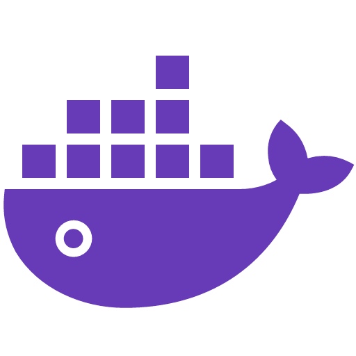
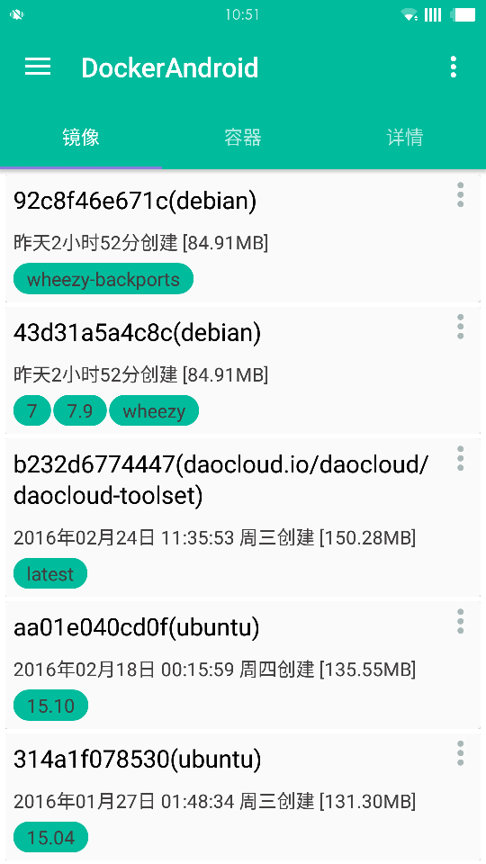
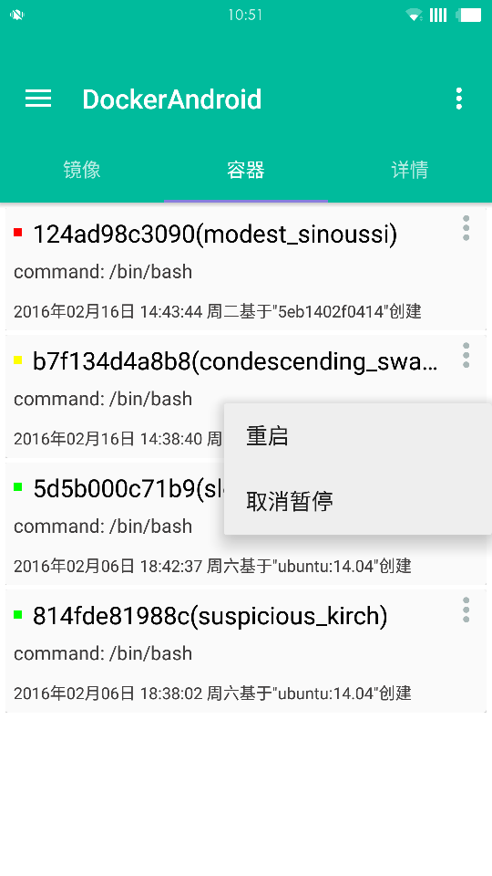
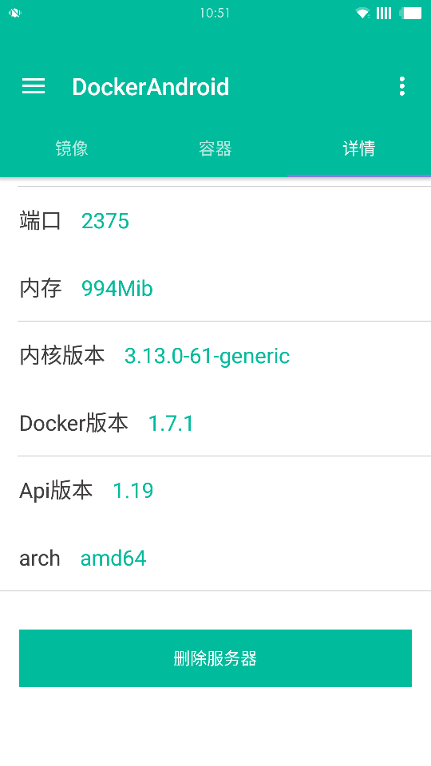
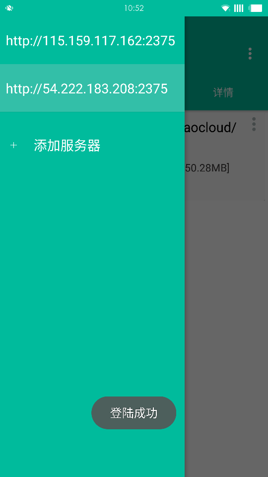
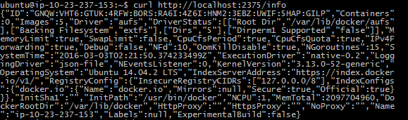

# Docker Android APP

Amberjack based on Docker Remote API, get image and containter's info from docker server

# What does it look like ?

# How to use?

* Firstly, you must have a server installed Docker.
* Secondly, modify `  /etc/default/docker` file, add TCP connection mode to DOCKER_OPTS. The file maybe empty, so you also need add unix-sock mode, like this:

	 DOCKER_OPTS="-H tcp://0.0.0.0:2375 -H unix:///var/run/docker.sock"
* Restart docker.
	
	 sudo service docker restart

* Finally, test on your server: 
	
	curl http://localhost:2375/info

If response like below , you are ready!

Try to login with your IP and Port! Have Fun!

#Test Running

> gralde installFirDebug

#Download:

[http://fir.im/docker](http://fir.im/docker)

#Thanks 
>* [RxJava](https://github.com/ReactiveX/RxJava)
>* [RxAndroid](https://github.com/ReactiveX/RxAndroid) 
>* [Dagger](https://github.com/square/dagger)
>* [Glide](https://github.com/bumptech/glide)
>* [Butter Knife](https://github.com/JakeWharton/butterknife)
>* [Retrofit](https://github.com/square/retrofit)
>* [OkHttp](https://github.com/square/okhttp)
>* [LeakCanary](https://github.com/square/leakcanary)
>* [Logger](https://github.com/orhanobut/logger)
>* [Stetho](https://github.com/facebook/stetho)

# About me

saymagic.dev@gmail.com

# LICENSE

   Copyright 2016 Saymagic

   Licensed under the Apache License, Version 2.0 (the "License");
   you may not use this file except in compliance with the License.
   You may obtain a copy of the License at

       http://www.apache.org/licenses/LICENSE-2.0

   Unless required by applicable law or agreed to in writing, software
   distributed under the License is distributed on an "AS IS" BASIS,
   WITHOUT WARRANTIES OR CONDITIONS OF ANY KIND, either express or implied.
   See the License for the specific language governing permissions and
   limitations under the License.
